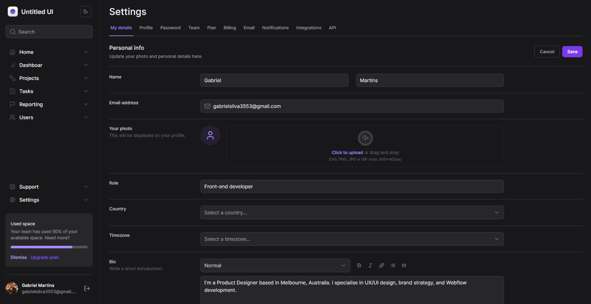
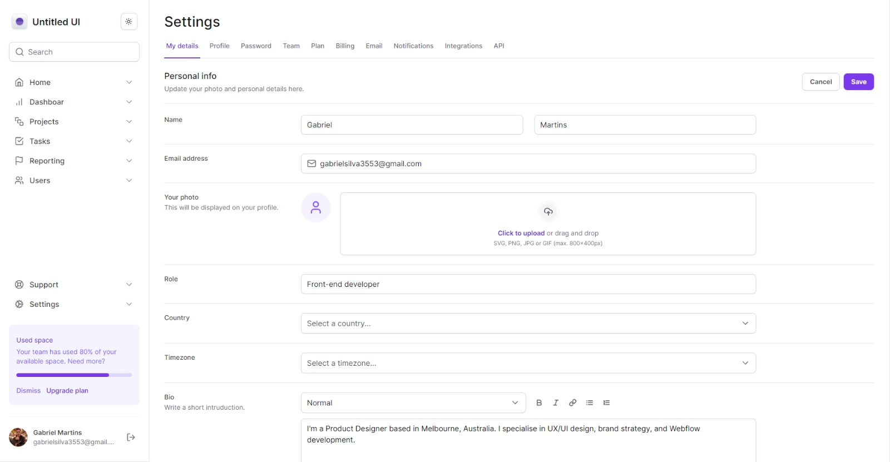

<h1 align='center'>Mastering Tailwind</h1>

## Descrição
Projeto desenvolvido para aprimorar as habilidades no uso do Tailwind CSS

## Aviso

Este projeto é puramente visual e não possui funcionalidades implementadas. Serve como uma plataforma para experimentação e prática com o Tailwind CSS. Não há funcionalidades interativas ou de backend implementadas, sendo focado exclusivamente na estilização e design.

## Aprendizado
Durante o desenvolvimento deste projeto, aprendi técnicas e conceitos importantes relacionados ao Tailwind CSS. Alguns dos tópicos incluem:

- **Utilização de Classes Utilitárias:** estilização eficiente e consistente.

- **Configuração do Tailwind:** Compreensão do processo de configuração e personalização do Tailwind para atender às necessidades específicas do projeto.

- **Responsividade:** Implementação de designs responsivos usando as funcionalidades fornecidas pelo Tailwind CSS.

- **Padronizações para Coesão de Design:** Reconhecimento da importância de padronizações e diretrizes de design para manter uma aparência coesa e profissional em todo o projeto.

- **Troca de Tema:** Exploração da troca dinâmica de temas para oferecer aos usuários a flexibilidade de personalizar a aparência do aplicativo de acordo com suas preferências.

## Como Executar o Projeto Localmente

Se você quiser visualizar o projeto localmente, siga os passos abaixo:

1. Clone este repositório.
2. Navegue até o diretório do projeto.
3. Execute `npm install` para instalar as dependências.
4. Execute `npm buil` para fazer a build antes de execultar.
5. Execute `npm start` para iniciar o servidor de desenvolvimento.

Acesse [http://localhost:3000](http://localhost:3000) no seu navegador para visualizar o projeto.

## Preview do Projeto

